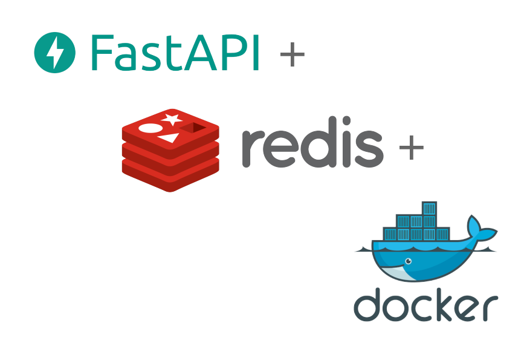

# Task Manager API

This is a simple API for managing tasks in a Redis database. It uses the Redis-OM library to manage data in a HashModel. 

## Endpoints 

* `POST /task`: Create a new task. Expects a JSON body containing the name and description of the task.

* `GET /tasks`: Get a list of all tasks.

* `PUT /task/{pk}`: Update an existing task. Expects a JSON body containing the name and description of the task.

* `DELETE /task/{pk}`: Delete an existing task.

## Techs

  

## Docker configuration

`docker-compose.yml` it's a Docker configuration file that sets up two services, Redis and Redis Commander. Redis is an open-source, in-memory data structure store, used as a database, cache, and message broker. Redis Commander is a GUI for managing Redis databases.

The Redis service is set up to use the latest Redis image, and to listen on port 6379. The Redis data is stored in a Docker volume named "redis-data" for persistence.

The Redis Commander service is set up to use the latest Redis Commander image, and to listen on port 8081. It is configured to connect to the Redis service, and it uses HTTP Basic Authentication with the credentials "admin/admin".

This configuration will set up both services, and they can be accessed from outside the Docker network.
